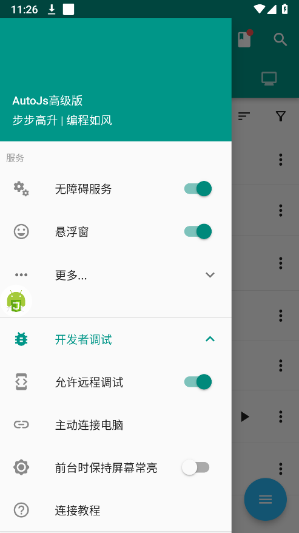

# ✨ Auto.js Pro 高级版

Auto.js 高级版基于 **Auto.js Pro 9.3.11** 停服后的完美复活版本，修复服务器 API，自搭建优化，功能与原官方 Pro 版本一致，并新增多项增强特性。为脚本开发者提供 **免 Root**、**免 Host 转发**、**打包稳定**、**运行高效** 的自动化平台。

---
## 🔥🔥 Auto.js Pro 8.4.1 - 免费版

基于Auto.js Pro 8.4.1制作的免费版，无任何的设备限制，可以任意登录。

- 🚫 **使用时间限制**：可使用时间每天的5:00-24:00
- ✅ **共存优化版本**：可与Auto.js Pro 9.3.11高级版共存。

---

## 🔥🔥🔥 Auto.js 高级版 9.3.11 - 全网完美版

深度优化的本地客户端与服务器，带来以下核心特性：

- 🚫 **无需配置 Host**：无缝对接服务器 API，省去复杂网络配置。
- ✅ **打包不闪退**：深度定制客户端，彻底解决脚本打包闪退问题。
- 🌍 **多设备支持**：邀请码通用，灵活切换设备。
- 🚀 **一键安装**：快速上手，极致直装体验。
- 💻 **支持电脑远程调试**：通过 VsCode 远程连接，高效调试脚本。
- 📱 **微信混淆控件适配**：支持最新版微信混淆控件的识别与点击，完美支持打包。
- ⚙️ **自定义无障碍服务类名**：支持打包时自定义无障碍服务类名，适配特定应用的检测机制或白名单要求。
- 🔄 **开机自启支持**：打包后支持开机自启功能，自动化更省心。
- ☁️ **完美热更新**：支持网络加载 JS 代码、快照源码、工程 Zip 代码，灵活部署。
  
<div align="center">
  
  
  
</div>

---

## 🚀 快速上手指南

1. 📱 打开应用，点击 **“登录”** 按钮。
2. 🔑 输入 **邀请码**，即可解锁所有功能。

---

## 💬 交流与支持

- 📲 **QQ 群**：加入 [1053378738](https://qm.qq.com/q/vhmvPPd1RY) 获取支持与交流。

---

## ✨ 核心功能特性

### 🔗 无缝对接官方 API

- 🛠️ 支持所有 **Auto.js 原生 API**。
- 🔌 兼容所有第三方扩展，支持自创扩展。
- 📸 内置完整 **OCR 插件**，满足图像识别需求。

### 🛡️ 免 Root & 免 Host 转发

- 🔧 源码级优化，实现后台直连。
- 🌐 内建流量转发机制，无需 Root 或 Host。
- 📲 安装即用，无需额外权限配置。

### 🔓 解锁功能限制

- ✅ 自动解除主流 App 控件点击限制，提升兼容性。
- 🛠️ 适配复杂界面，增强自动化执行成功率。

### 🔒 代码加密与安全

- 🔐 **增强型离线加密**：保护脚本逻辑。
- 📷 **快照加密**：确保核心代码安全。
- 🛡️ 防止脚本逻辑泄露，保障开发者权益。

### 🔄 邀请码多设备支持

- 📱 同一邀请码支持多设备切换使用。
- ⚠️ **注意**：跨 IP 使用可能导致账号挤出，建议合理规划使用。

---

## ⚙️ 特色亮点

1. **深度优化 Auto.js Pro 9.3.11**：
   - 🛠️ 功能完整，打包稳定不闪退。
   - 🚀 免 Host 配置，即装即用。
2. **适配最新微信混淆控件**：
   - 📲 精准识别与点击，提升自动化成功率。
3. **支持打包脚本开机启动**：

```javascript
$settings.setEnabled('boot_restart', true);
```

> 💡 **提示**：需卸载旧版本并安装本高级版后生效。

4. **支持 VsCode 远程调试**：
   - 💻 通过电脑远程连接 VsCode，实时调试脚本，提升开发效率。
5. **自定义无障碍服务类名**：
   - ⚙️ 打包时支持自定义无障碍服务类名，适配特定应用检测机制。
6. **完美热更新支持**：
   - ☁️ 支持网络加载 JS、快照、工程 Zip 文件，灵活实现代码热更新。

---

## 🌐 运行网络代码资源

Auto.js 高级版支持运行 **本地** 或 **远程** 的 JS、快照、工程 Zip 文件，极大提升部署与热更新灵活性。

### 📂 运行本地快照文件

```javascript
engines.execScriptFile("/sdcard/Pictures/xxxx.snapshot"); // 后缀必须为 .snapshot
```

### ☁️ 运行网络资源文件

支持以下三种网络资源类型：

#### 📄 JS 文件（JavaScript 脚本）

```javascript
engines.execScriptFile("https://xxxbeijing.aliyuncs.com/PMTT3.js");
```

#### 📦 快照文件（.snapshot）

```javascript
engines.execScriptFile("https://xxxxxxg.aliyuncs.com/PMTT3.snapshot");
```

#### 🧳 Project.zip 工程包

```javascript
engines.execScriptFile("https://xxxxxxg.aliyuncs.com/PMTT3.zip");
```

#### 💡 自动判断文件类型（示例：蓝奏云解析）

```javascript
engines.execScriptFile("https://lz.qaiu.top/parser?url=https://apkxxxxxx.lanzouo.com/iPuxxxxxmkmkj");
```

> ⚠️ **注意事项**：
>
> - **调试阶段**：Zip 包中 JS 文件需为明文。
> - **打包独立 APK**：支持全加密 Project Zip，保障逻辑安全并实现热更新。

---

## 📜 版权与声明

- 📚 所有资源整理自互联网，版权归原作者所有。
- ⚖️ 如有侵权或问题，请联系维护者及时处理。

